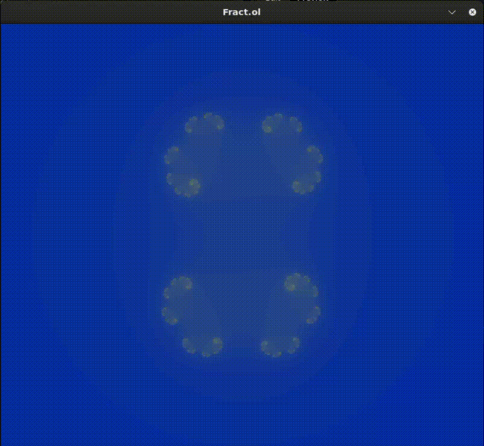
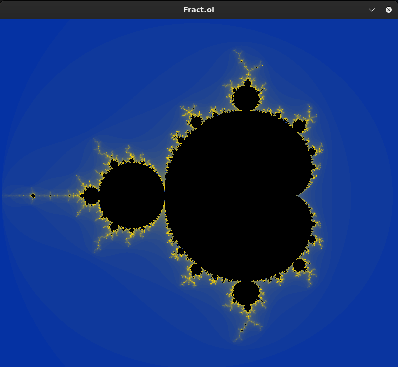
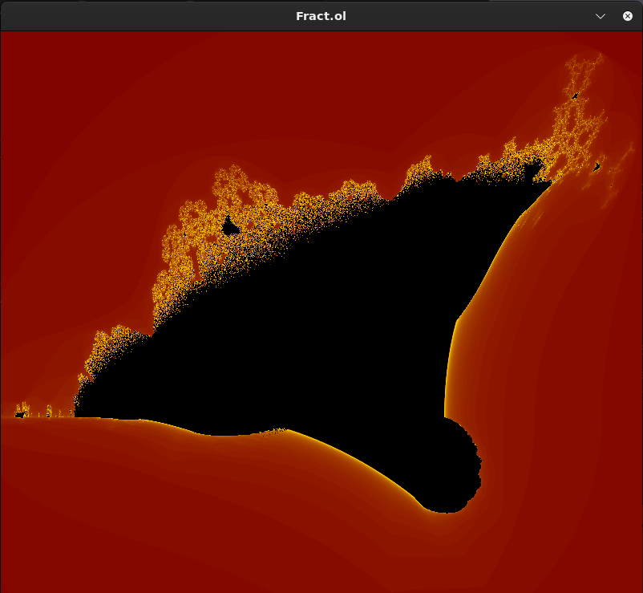

# Fractal Viewer

**Description :**  
Fract-ol est un projet qui permet de visualiser et explorer différentes fractales mathématiques, notamment **Julia**, **Mandelbrot**, et **Burning Ship**.

---

### **Usage**
```
make
./fractol <type>
```

Julia Fractal
```
./fractol julia <2 number between -2 and 2>
```


Mandelbrot Fractal
```
./fractol mandelbrot
```


Burning Ship Fractal
```
./fractol burning_ship
```
<p align="center">
  
  
</p>
